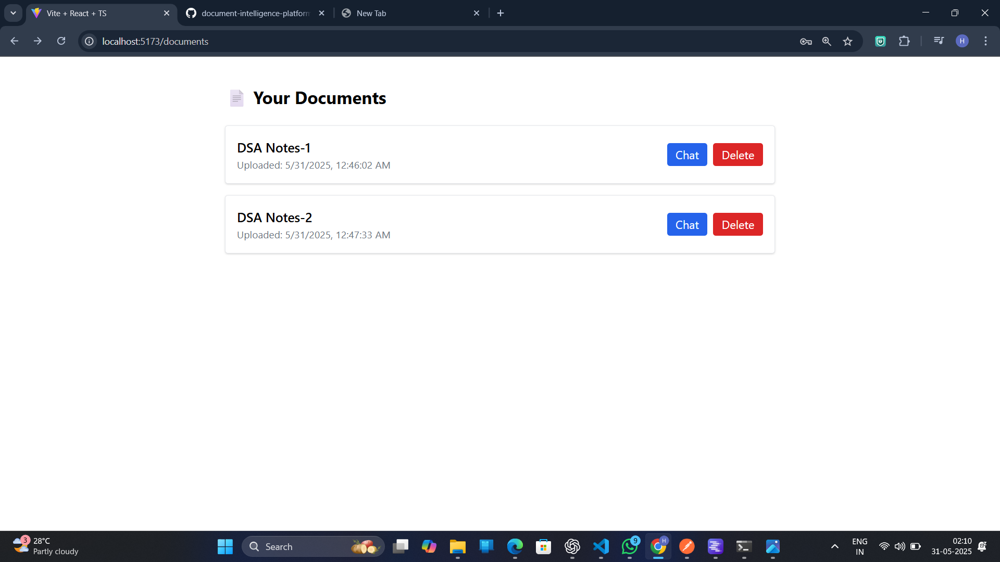

Here's a complete and professional `README.md` file that fits your **submission format**:

---

````markdown
# 📄 Document Intelligence Platform

An AI-powered platform to intelligently extract, summarize, and answer questions from documents like PDFs and Word files. Built using Django REST Framework and React, with OpenAI integration.

---

## 🌐 Screenshots

### 🔐 Login Page


### 📝 Register Page


### 📁 Upload Document Page


### Documents List Page


### 🤖 Chat Page


---

## ⚙️ Setup Instructions

### 🔧 Prerequisites

- Python 3.10+
- Node.js and npm
- SQLite

---

### 1️⃣ Backend Setup

```bash
# Navigate to Backend
cd Backend

# Create virtual environment
python -m venv venv
venv\Scripts\activate   # (or source venv/bin/activate on Mac/Linux)

# Install dependencies
pip install -r requirements.txt

# Set up .env file
cp .env.example .env  # Create this file with your API keys

# Apply migrations
python manage.py migrate

# Run server
python manage.py runserver
````

---

### 2️⃣ Frontend Setup

```bash
# Navigate to Frontend
cd Frontend

# Install dependencies
npm install

# Start the development server
npm start
```

---

## 🧪 Sample Documents

Sample test files are located in the `sample_documents/` folder:

* `sample_documents/DSA Notes-1.pdf`
* `sample_documents/DSA Notes-2.docx`

---


## 📚 API Documentation

### 🔐 Auth APIs

| Method | Endpoint         | Description             |
| ------ | ---------------- | ----------------------- |
| POST   | `/api/register/` | Register new user       |
| POST   | `/api/login/`    | Login and receive token |

### 📄 Document APIs

| Method | Endpoint          | Description                |
| ------ | ----------------- | -------------------------- |
| POST   | `/api/upload/`    | Upload document (PDF/DOCX) |
| GET    | `/api/documents/` | List uploaded documents    |

### 🤖 AI-Powered QA APIs

| Method | Endpoint                   | Description              |
| ------ | -------------------------  | ------------------------ |
| POST   | `/api/documents/{id}/ask/` | Ask a question about doc |

---

## ❓ Sample Questions & Answers

### 📝 Sample Document

**Document:** Resume of "Jane Doe"

### ❓ Questions

| Question                    | Answer                                              |
| --------------------------- | --------------------------------------------------- |
| What is Jane's email?       | [jane.doe@example.com](mailto:jane.doe@example.com) |
| Where did Jane work before? | Senior Developer at TechCorp Inc.                   |
| Skills mentioned?           | Python, Django, React, AWS                          |
| Education background?       | B.Tech in Computer Science from MIT                 |

---

## 📦 Dependencies

Included in `requirements.txt`:

```txt
Django>=4.0
djangorestframework
python-dotenv
PyJWT
openai
python-docx
PyPDF2
```

---

## 👨‍💻 Authors

* RHariDev

---
